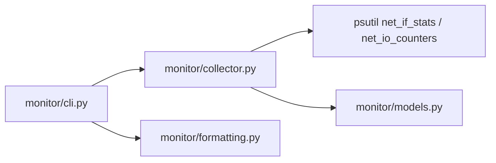
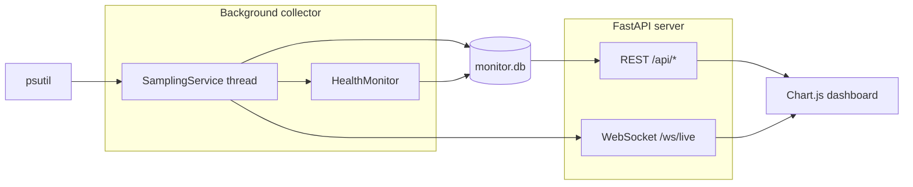

# py-bandwidth-monitor

Simple local network interface bandwidth monitor written in Python.

This tool reads kernel network counters on the machine where it runs using
`psutil`. It is useful for checking interface status, cumulative traffic, and
live upload/download rates per network interface.

Phase 2 adds a web dashboard with SQLite history, REST APIs, and WebSocket live
updates.

## Requirements

- Python 3.10+
- `psutil`
- `fastapi`
- `uvicorn`

## Install

```bash
pip install -r requirements.txt
```

Recommended: use a virtual environment.

```bash
python3 -m venv .venv
source .venv/bin/activate   # macOS / Linux
pip install -r requirements.txt
```

## Usage

Take a one-shot snapshot of monitored interfaces:

```bash
python -m monitor snapshot
```

Watch live upload and download rates in the terminal:

```bash
python -m monitor watch
```

Start the web dashboard:

```bash
python -m monitor serve
```

Open [http://127.0.0.1:8080](http://127.0.0.1:8080) in your browser.

The legacy entry point still works:

```bash
python main.py snapshot
python main.py watch
python main.py serve
```

### Running on macOS

On a MacBook, interface names are usually `en0` (Wi‑Fi), not Linux-style `eth0`
/ `wlan0`. Check what's available first:

```bash
python3 -m monitor snapshot
```

Then monitor a specific interface:

```bash
python3 -m monitor serve --include en0
python3 -m monitor watch --include en0
```

Stop terminal commands with **Ctrl+C** (not Cmd+C — Cmd+C is copy on Mac).

### Dashboard

The dashboard includes:

- **Live overview** — total upload/download speeds with sparklines
- **Per interface** — interface selector and 5 / 15 / 60 minute charts
- **Interface table** — link status, cumulative totals, errors, and drops
- **Health panel** — link up/down events and rising error/drop alerts

Sample data is stored locally in SQLite (`monitor.db` by default) and retained
for 7 days.

```bash
python -m monitor serve --host 0.0.0.0 --port 8080 --db monitor.db --interval 1
```

### Interface filters

By default, loopback and common virtual interfaces are excluded (`lo`,
`docker*`, `veth*`, `br-*`, `virbr*`).

Monitor only specific interfaces:

```bash
python -m monitor watch --include eth0 --include wlan0
python -m monitor serve --include en0
```

Exclude additional interfaces:

```bash
python -m monitor snapshot --exclude docker0 --exclude br-*
```

### JSON output

```bash
python -m monitor snapshot --json
python -m monitor watch --json
```

### Watch options

```bash
python -m monitor watch --interval 2 --history-size 1800
python -m monitor watch --duration 30
python -m monitor watch --samples 10
```

`watch` keeps recent samples in an in-memory ring buffer. The default history
size is 3600 samples, which is about one hour at a 1 second interval.

### Stopping long-running commands

On a normal terminal, press **Ctrl+C** (not Cmd+C on Mac) to stop.

Cloud agent and web terminals often do not forward keyboard interrupts reliably.
Use one of these instead:

```bash
python -m monitor watch --duration 30
python -m monitor watch --samples 10
pkill -f "monitor watch"
pkill -f "monitor serve"
```

## Commands

| Command | Description |
|---------|-------------|
| `snapshot` | Print interface link status and cumulative byte/packet counters |
| `watch` | Print live per-interface upload/download rates every interval |
| `serve` | Start the FastAPI dashboard and background sampler |

## API

| Endpoint | Description |
|----------|-------------|
| `GET /api/overview?minutes=5` | Latest totals plus aggregate history |
| `GET /api/history?interface=eth0&minutes=15` | Per-interface rate history |
| `GET /api/interfaces` | Latest interface snapshots and rates |
| `GET /api/health?limit=50` | Recent health events |
| `WS /ws/live` | Live sample stream for the dashboard |

---

## Project scope

| Monitors | Does not monitor (yet) |
|----------|------------------------|
| NICs on the machine running the tool | Other devices on the home LAN |
| Cumulative kernel counters since boot | Per-process or per-connection usage |
| Aggregate or per-interface upload/download rates | Router QoS, ISP usage caps, WAN-only traffic |
| Local interface up/down and link speed | Remote hosts without an agent |

**Original intent:** a small home utility to inspect bandwidth on the local
machine — interface metadata, cumulative I/O, and live transfer rates.

**Not in scope for Phases 1–2:** router/gateway APIs, SNMP, packet capture,
multi-host agents, or LAN-wide per-device traffic.

---

## Roadmap

| Phase | Status | Summary |
|-------|--------|---------|
| **Phase 1** | Done | Collector refactor, CLI (`snapshot`, `watch`), per-interface rates |
| **Phase 2** | Done | SQLite storage, FastAPI server, Chart.js dashboard |
| **Phase 3** | In progress | Deployment + integration tests done; alerts, rollups, config planned |
| **Phase 4** | Planned | Home LAN / multi-device monitoring (router APIs, agents) |

---

## Phase design and implementation

### Phase 1 — Collector and CLI

**Goal:** Turn the original prototype into a structured, testable monitoring
tool with proper CLI commands.

**Deliverables**

- Refactor monolithic `main.py` into a `monitor/` package
- `snapshot` command — one-shot interface status and cumulative counters
- `watch` command — live per-interface upload/download rates (separate, not combined)
- Interface filtering (`--include` / `--exclude`) with defaults for loopback and virtual NICs
- In-memory ring buffer during `watch`
- `--json` output for scripting
- `requirements.txt` with pinned `psutil`
- Unit tests for filtering, formatting, and collector sampling

**Architecture**



**Key files**

| File | Role |
|------|------|
| `monitor/collector.py` | Sampling, rate calculation, ring buffer |
| `monitor/cli.py` | `snapshot` and `watch` commands |
| `monitor/models.py` | `InterfaceStats`, `InterfaceRates`, `AggregateRates` |
| `monitor/formatting.py` | Human-readable bytes and bit rates |

---

### Phase 2 — Web dashboard

**Goal:** Visual dashboard with persistent history so monitoring is not limited
to terminal output.

**Deliverables**

- SQLite time-series storage (`monitor/storage.py`)
- Background sampler thread (`monitor/service.py`)
- Health event detection — link up/down, rising errors/drops (`monitor/health.py`)
- FastAPI REST + WebSocket server (`monitor/server.py`)
- `serve` CLI command
- Chart.js dashboard UI (`monitor/static/`)

**Dashboard views**

1. **Live overview** — total up/down speed, sparklines
2. **Per interface** — toggle interface (e.g. `en0` / `eth0`), line chart over 5 / 15 / 60 min
3. **Interface table** — link status, cumulative totals, error/drop counts
4. **Health indicators** — link down events, rising error rates

**Tech stack (lightweight, Python-native)**

| Layer | Choice |
|-------|--------|
| Backend | FastAPI — REST + WebSocket for live updates |
| Storage | SQLite — local history (hourly/daily rollups in Phase 3) |
| Frontend | Plain HTML + CSS + Chart.js (no React build step) |
| Sampling | Background thread via `psutil` |

**Architecture**



**SQLite schema**

| Table | Purpose |
|-------|---------|
| `rate_samples` | Per-interface and aggregate transfer rates over time |
| `interface_snapshots` | Link status, MTU, cumulative bytes/packets/errors/drops |
| `health_events` | Link up/down, high error/drop alerts |

**Key files**

| File | Role |
|------|------|
| `monitor/storage.py` | SQLite read/write, retention pruning |
| `monitor/service.py` | Background sampler + WebSocket bridge |
| `monitor/health.py` | Link and error/drop event detection |
| `monitor/server.py` | FastAPI app, routes, static file serving |
| `monitor/static/index.html` | Dashboard layout |
| `monitor/static/app.js` | Charts, WebSocket client, API polling |
| `monitor/static/styles.css` | Dashboard styling |

**Development split (git worktrees)**

Phase 2 was implemented in parallel worktrees and merged:

| Worktree branch | Responsibility |
|-----------------|----------------|
| `cursor/phase2-storage-api-3189` | SQLite, health checks, FastAPI server, `serve` CLI |
| `cursor/phase2-frontend-3189` | Chart.js dashboard UI |
| `cursor/phase2-dashboard-3189` | Integration branch |

```bash
# Example worktree setup for future phases
git worktree add -b cursor/phase3-alerts-3189 ../worktrees/phase3-alerts master
git worktree add -b cursor/phase3-ui-3189 ../worktrees/phase3-ui master
```

---

### Phase 3 — Alerts, rollups, and deployment (in progress)

**Goal:** Production-ready home monitoring on an always-on machine (Mac,
Raspberry Pi, NAS).

**Deliverable status**

| Area | Status | Notes |
|------|--------|-------|
| **Deployment** | Done | `Dockerfile`, `docker-compose.yml`, `deploy/systemd/bandwidth-monitor.service` |
| **Testing** | Done | `tests/test_integration.py` — API + sampler with mocked `psutil` |
| **Alerts** | Planned | Threshold alerts (e.g. > 100 Mbps, sustained high errors) |
| **Notifications** | Planned | Email, webhook, or desktop notification hooks |
| **Retention rollups** | Planned | 7 days of 1s samples; 30 days of 1-minute averages |
| **Config file** | Planned | YAML/JSON for interfaces, intervals, thresholds |
| **Polish** | Planned | Better virtual-interface filtering, pinned dependency lockfile |

**Suggested build order (remaining work)**

1. Config file (YAML/JSON) for interfaces, intervals, thresholds
2. Hourly/daily rollup job (SQLite aggregation or cron)
3. Alert engine evaluating thresholds against live + historical data
4. Notification adapters (webhook first, then email/desktop)

**Open questions for Phase 3**

- Where will it run? Same machine as browser, or dedicated always-on host?
- Which notification channel matters most? (Telegram/Slack webhook, email, macOS notification)
- Should the dashboard be LAN-accessible only or exposed via reverse proxy?

---

## Deployment (home server / Raspberry Pi)

Run the dashboard on an always-on host so history survives reboots and you can
open the UI from any device on your LAN.

**Data persistence:** SQLite lives at the path passed to `--db` (default
`monitor.db`). Mount a volume or dedicated directory — the database is lost if
the container filesystem is ephemeral.

**LAN access:** bind to `0.0.0.0` (Docker and systemd examples below do this).
Open `http://<host-ip>:8080` from another machine on the network. Do not expose
port 8080 to the public internet without a reverse proxy and authentication.

### Docker (recommended for Pi / NAS)

Build and run with a named volume for the database:

```bash
docker build -t bandwidth-monitor .
docker run -d \
  --name bandwidth-monitor \
  --restart unless-stopped \
  -p 8080:8080 \
  -v bandwidth-monitor-data:/data \
  bandwidth-monitor
```

Or use Compose:

```bash
docker compose up -d --build
```

Monitor a specific interface (Raspberry Pi `eth0`, Mac `en0`, etc.):

```bash
docker run -d \
  --name bandwidth-monitor \
  --restart unless-stopped \
  -p 8080:8080 \
  -v bandwidth-monitor-data:/data \
  bandwidth-monitor \
  python -m monitor serve --host 0.0.0.0 --port 8080 --db /data/monitor.db --include eth0
```

The image runs as a non-root `monitor` user and stores data under `/data`.

### systemd (bare metal / venv install)

1. Clone the repo and create a virtual environment:

```bash
sudo mkdir -p /opt/bandwidth-monitor /var/lib/bandwidth-monitor
sudo git clone https://github.com/andywongcheeming/py-bandwith-monitor.git /opt/bandwidth-monitor
cd /opt/bandwidth-monitor
python3 -m venv .venv
.venv/bin/pip install -r requirements.txt
sudo useradd --system --home /opt/bandwidth-monitor --shell /usr/sbin/nologin monitor || true
sudo chown -R monitor:monitor /opt/bandwidth-monitor /var/lib/bandwidth-monitor
```

2. Install the unit file and start the service:

```bash
sudo cp deploy/systemd/bandwidth-monitor.service /etc/systemd/system/
sudo systemctl daemon-reload
sudo systemctl enable --now bandwidth-monitor.service
sudo systemctl status bandwidth-monitor.service
```

3. Optional: edit `ExecStart` in the unit to add `--include eth0` (or `en0` on
   Mac) and adjust `--retention-days` as needed.

Logs: `journalctl -u bandwidth-monitor.service -f`

### Always-on Mac

Use Docker as above, or run under `launchd` with the same `python -m monitor serve`
command. For a quick LAN-visible instance without Docker:

```bash
python -m monitor serve --host 0.0.0.0 --port 8080 --db ~/bandwidth-monitor/monitor.db
```

Keep the Mac awake (Energy Saver → prevent sleep when display is off, or use
`caffeinate` in a `tmux`/`screen` session).

### Render (optional cloud host)

If you deploy to [Render](https://render.com), bind to `0.0.0.0:$PORT` and
attach a persistent disk for SQLite — Render's filesystem is ephemeral without
one. Example start command:

```bash
python -m monitor serve --host 0.0.0.0 --port $PORT --db /data/monitor.db
```

Future Phase 3 config may expose env vars such as `MONITOR_DB`, `MONITOR_INCLUDE`,
and `MONITOR_INTERVAL`; until then, pass flags via Docker `command` or systemd
`ExecStart`.

---

### Phase 4 — Home LAN / multi-device monitoring (planned)

**Goal:** Monitor traffic beyond the local machine — other phones, TVs, laptops
on the home network.

**Important:** This is a separate layer on top of Phases 1–3. The current
`psutil`-based collector cannot see other LAN devices without new data sources.

**Approach options**

| Approach | Effort | What you get |
|----------|--------|--------------|
| Router API (UniFi, OpenWrt, pfSense) | Medium | Per-device traffic if the router exposes it |
| SNMP from router | Medium | WAN/LAN totals, sometimes per-port |
| Mirror port + flow collector (ntopng) | High | Full LAN visibility |
| Agent on each device | Medium | Accurate per-machine stats, reports to central dashboard |

**Planned deliverables**

- Router adapter abstraction (plugin interface per vendor/API)
- Optional lightweight agent that reports to the central FastAPI server
- Multi-host dashboard view (device list, per-device charts)
- Central SQLite or Postgres for aggregated multi-host metrics

**Prerequisite:** Phase 3 deployment story (always-on collector host, persistent
storage, stable API).

---

## Project structure

```
monitor/
  cli.py           # snapshot, watch, serve commands
  collector.py     # psutil sampling and rate calculation
  storage.py       # SQLite persistence
  service.py       # background sampler thread
  health.py        # link/error health events
  server.py        # FastAPI app
  models.py        # data types
  formatting.py    # human-readable output helpers
  static/
    index.html     # dashboard page
    app.js         # Chart.js + WebSocket client
    styles.css     # dashboard styles
tests/
  test_monitor.py      # Phase 1 tests
  test_storage.py      # SQLite + health tests
  test_server.py       # API endpoint tests
  test_integration.py  # sampler + API integration (mocked psutil)
deploy/
  systemd/
    bandwidth-monitor.service
Dockerfile
docker-compose.yml
main.py            # legacy entry point
requirements.txt
monitor.db         # created at runtime (gitignored)
```

---

## License

This project is licensed under the MIT License - see the [LICENSE](LICENSE) file for details.
