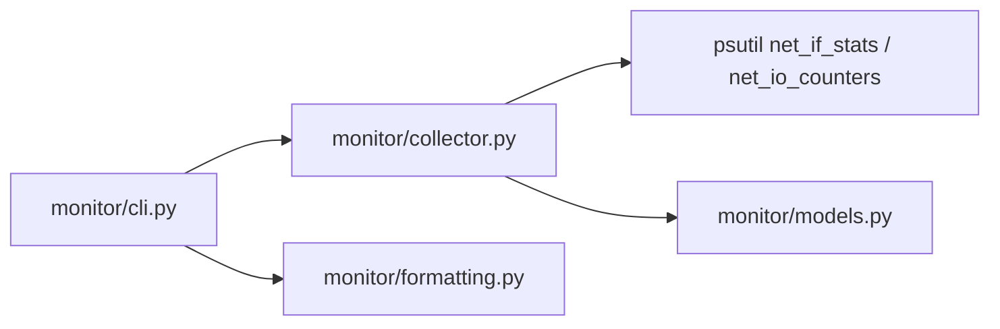
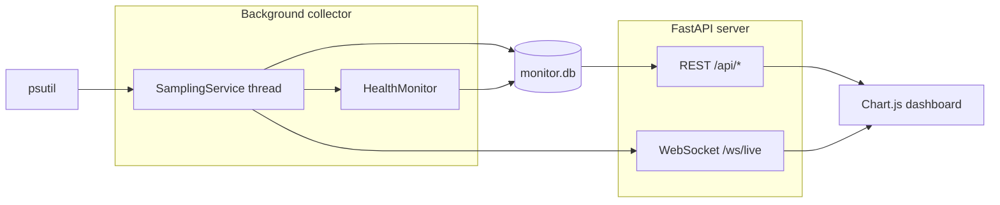

# py-bandwidth-monitor

Simple local network interface bandwidth monitor written in Python.

This tool reads kernel network counters on the machine where it runs using
`psutil`. It is useful for checking interface status, cumulative traffic, and
live upload/download rates per network interface.

Phase 2 adds a web dashboard with SQLite history, REST APIs, and WebSocket live
updates. Phase 3 adds YAML config, retention rollups, threshold alerts with
webhook notifications, and Docker/systemd deployment packaging.

## Requirements

- Python 3.10+
- `psutil`
- `fastapi`
- `uvicorn`
- `pyyaml` (optional config file)

## Install

```bash
pip install -r requirements.txt
```

For reproducible installs, use the pinned lockfile:

```bash
pip install -r requirements.lock
```

Recommended: use a virtual environment.

```bash
python3 -m venv .venv
source .venv/bin/activate   # macOS / Linux
pip install -r requirements.txt
```

## Secrets and local config (public repo)

This repository is intended to be **public**. Nothing in git should contain
real credentials, tokens, or session cookies.

**Safe to commit (already in the repo)**

| File | Purpose |
|------|---------|
| `config.example.yaml` | Template with `null` placeholders — copy locally |
| `.env.example` | Template env var names — copy to `.env` locally |
| `README.md` | Uses `...` / `example.com` placeholders only |

**Never commit (gitignored)**

| Path / variable | What it is |
|-----------------|------------|
| `.env`, `.env.local`, … | Local env files with real values |
| `config.yaml` | Your edited config (agent token, webhook URL, etc.) |
| `monitor.db`, `eero_monitor.db` | Runtime SQLite (may embed operational data) |
| `~/.cloudflared/*.json` | Cloudflare tunnel credentials (keep under your home dir) |
| `EERO_SESSION`, `EERO_NETWORK_ID` | Eero API session — env vars only |
| `MONITOR_AGENT_TOKEN` | Agent ingest bearer token — env or local `config.yaml` |

**Recommended workflow**

```bash
cp config.example.yaml config.yaml    # main monitor (optional)
cp .env.example .env                  # Eero + env-based secrets (optional)
# edit both locally; never git add them
```

Load env vars before running Eero commands:

```bash
set -a && source .env && set +a
python -m eero_monitor serve
```

For `launchd` or systemd, put secrets in the unit's `Environment=` /
`EnvironmentFile=` pointing at a file **outside** the repo (e.g.
`/etc/bandwidth-monitor/env` or `~/Library/LaunchAgents/secrets.env`).

**Before pushing:** run `git status` and confirm no `.env`, `config.yaml`, or
`*.db` files are staged. If a secret was ever committed, rotate it immediately
(Eero: `python -m eero_monitor login`; agent token: generate a new random
string) — removing it from git history requires a force-push and does not
revoke a leaked token.

## Usage

Take a one-shot snapshot of monitored interfaces:

```bash
python -m monitor snapshot
```

Watch live upload and download rates in the terminal:

```bash
python -m monitor watch
```

Start the web dashboard:

```bash
python -m monitor serve
```

Open [http://127.0.0.1:8080](http://127.0.0.1:8080) in your browser.

Run an agent that posts samples to a central hub (Phase 4):

```bash
python -m monitor agent --server http://HUB:8080 --token "$MONITOR_AGENT_TOKEN"
```

The legacy entry point still works:

```bash
python main.py snapshot
python main.py watch
python main.py serve
```

### Running on macOS

On a MacBook, interface names are usually `en0` (Wi‑Fi), not Linux-style `eth0`
/ `wlan0`. Check what's available first:

```bash
python3 -m monitor snapshot
```

Then monitor a specific interface:

```bash
python3 -m monitor serve --include en0
python3 -m monitor watch --include en0
```

Stop terminal commands with **Ctrl+C** (not Cmd+C — Cmd+C is copy on Mac).

### Dashboard

The dashboard includes:

- **Host selector** — switch between the hub (`local`) and reporting agents
- **Live overview** — total upload/download speeds with sparklines
- **Per interface** — interface selector and 5 / 15 / 60 minute charts
- **Interface table** — link status, cumulative totals, errors, and drops
- **Health panel** — link up/down events and rising error/drop alerts
- **Alert status** — header indicator for armed thresholds; recent alerts via `/api/alerts`

Sample data is stored locally in SQLite (`monitor.db` by default). Raw 1s
samples are retained for 7 days by default; minute/hourly/daily rollups keep
longer history for charts.

```bash
python -m monitor serve --host 0.0.0.0 --port 8080 --db monitor.db --interval 1
```

### Configuration file

Copy `config.example.yaml` to `config.yaml` (or pass `--config /path/to/config.yaml`).
The file is optional; defaults match the CLI when no config is present.

| Section | Keys | Purpose |
|---------|------|---------|
| `interfaces` | `include`, `exclude` | Glob patterns for monitored NICs |
| `sampling` | `interval`, `history_size` | Sample interval and in-memory buffer |
| `server` | `host`, `port`, `db`, `host_id` | Dashboard bind, SQLite path, local sampler id |
| `agents` | `token` | Shared bearer token for agent ingest (`MONITOR_AGENT_TOKEN` preferred) |
| `retention` | `days`, `minute_samples_days`, … | Raw + rollup retention windows |
| `thresholds` | `recv_bps`, `sent_bps`, `total_bps`, … | Alert engine thresholds |
| `notifications` | `webhook_url` | Optional alert webhook (`ALERT_WEBHOOK_URL` overrides) |

CLI flags override config values. Example for a LAN-accessible home host:

```bash
cp config.example.yaml config.yaml
# edit interfaces.include for your NIC (e.g. en0)
python -m monitor serve
```

### Interface filters

By default, loopback and common virtual interfaces are excluded (`lo`,
`tun*`, `utun*`, `docker*`, `veth*`, `br-*`, `virbr*`, `wg*`, `vmnet*`, and
similar tunnel/container patterns).

Monitor only specific interfaces:

```bash
python -m monitor watch --include eth0 --include wlan0
python -m monitor serve --include en0
```

Exclude additional interfaces:

```bash
python -m monitor snapshot --exclude docker0 --exclude br-*
```

### JSON output

```bash
python -m monitor snapshot --json
python -m monitor watch --json
```

### Watch options

```bash
python -m monitor watch --interval 2 --history-size 1800
python -m monitor watch --duration 30
python -m monitor watch --samples 10
```

`watch` keeps recent samples in an in-memory ring buffer. The default history
size is 3600 samples, which is about one hour at a 1 second interval.

### Stopping long-running commands

On a normal terminal, press **Ctrl+C** (not Cmd+C on Mac) to stop.

Cloud agent and web terminals often do not forward keyboard interrupts reliably.
Use one of these instead:

```bash
python -m monitor watch --duration 30
python -m monitor watch --samples 10
pkill -f "monitor watch"
pkill -f "monitor serve"
```

## Commands

| Command | Description |
|---------|-------------|
| `snapshot` | Print interface link status and cumulative byte/packet counters |
| `watch` | Print live per-interface upload/download rates every interval |
| `serve` | Start the FastAPI dashboard and background sampler |
| `agent` | Sample local NICs and POST rates to a central hub |

## API

| Endpoint | Description |
|----------|-------------|
| `GET /api/hosts` | Known hosts and last-seen timestamps |
| `GET /api/overview?minutes=5&host=local` | Latest totals plus aggregate history |
| `GET /api/history?interface=eth0&minutes=15&host=local` | Per-interface rate history |
| `GET /api/interfaces?host=local` | Latest interface snapshots and rates |
| `GET /api/health?limit=50&host=local` | Recent health events |
| `POST /api/agents/samples` | Agent ingest (Bearer token required) |
| `WS /ws/live` | Live sample stream for the dashboard (`host_id` in hello/samples) |

---

## Project scope

| Monitors | Does not monitor (yet) |
|----------|------------------------|
| NICs on the hub and agent hosts | Devices without a running agent (phones/TVs unless an agent runs there) |
| Cumulative kernel counters since boot | Per-process or per-connection usage |
| Aggregate or per-interface upload/download rates | Router QoS, ISP usage caps, WAN-only traffic |
| Local interface up/down and link speed | Per-process or WAN ISP billing views |

**Original intent:** a small home utility to inspect bandwidth on the local
machine — interface metadata, cumulative I/O, and live transfer rates.

**Phase 4 adds:** lightweight agents that report the same NIC rates to a central
hub. Optional household-device monitoring via Eero is a separate sibling app —
see [Optional: Eero household monitor](#optional-eero-household-monitor).

---

## Roadmap

| Phase | Status | Summary |
|-------|--------|---------|
| **Phase 1** | Done | Collector refactor, CLI (`snapshot`, `watch`), per-interface rates |
| **Phase 2** | Done | SQLite storage, FastAPI server, Chart.js dashboard |
| **Phase 3** | Done | Config, retention rollups, alerts/webhook, Docker/systemd, integration tests |
| **Phase 4** | Done | Multi-host agents (per-device NIC rates → central hub) |
| **Eero monitor** | Optional | Sibling `eero_monitor` app for household devices via Eero cloud API |

---

## Phase design and implementation

### Phase 1 — Collector and CLI

**Goal:** Turn the original prototype into a structured, testable monitoring
tool with proper CLI commands.

**Deliverables**

- Refactor monolithic `main.py` into a `monitor/` package
- `snapshot` command — one-shot interface status and cumulative counters
- `watch` command — live per-interface upload/download rates (separate, not combined)
- Interface filtering (`--include` / `--exclude`) with defaults for loopback and virtual NICs
- In-memory ring buffer during `watch`
- `--json` output for scripting
- `requirements.txt` with pinned `psutil`
- Unit tests for filtering, formatting, and collector sampling

**Architecture**



**Key files**

| File | Role |
|------|------|
| `monitor/collector.py` | Sampling, rate calculation, ring buffer |
| `monitor/cli.py` | `snapshot` and `watch` commands |
| `monitor/models.py` | `InterfaceStats`, `InterfaceRates`, `AggregateRates` |
| `monitor/formatting.py` | Human-readable bytes and bit rates |

---

### Phase 2 — Web dashboard

**Goal:** Visual dashboard with persistent history so monitoring is not limited
to terminal output.

**Deliverables**

- SQLite time-series storage (`monitor/storage.py`)
- Background sampler thread (`monitor/service.py`)
- Health event detection — link up/down, rising errors/drops (`monitor/health.py`)
- FastAPI REST + WebSocket server (`monitor/server.py`)
- `serve` CLI command
- Chart.js dashboard UI (`monitor/static/`)

**Dashboard views**

1. **Live overview** — total up/down speed, sparklines
2. **Per interface** — toggle interface (e.g. `en0` / `eth0`), line chart over 5 / 15 / 60 min
3. **Interface table** — link status, cumulative totals, error/drop counts
4. **Health indicators** — link down events, rising error rates

**Tech stack (lightweight, Python-native)**

| Layer | Choice |
|-------|--------|
| Backend | FastAPI — REST + WebSocket for live updates |
| Storage | SQLite — local history with minute/hourly/daily rollups |
| Frontend | Plain HTML + CSS + Chart.js (no React build step) |
| Sampling | Background thread via `psutil` |

**Architecture**



**SQLite schema**

| Table | Purpose |
|-------|---------|
| `rate_samples` | Per-interface and aggregate transfer rates over time (raw 1s) |
| `rate_samples_minute` / `_hourly` / `_daily` | Rollup averages for longer history windows |
| `interface_snapshots` | Link status, MTU, cumulative bytes/packets/errors/drops |
| `health_events` | Link up/down, high error/drop alerts |
| `alert_events` | Threshold alert firings (bandwidth, sustained errors) |

**Key files**

| File | Role |
|------|------|
| `monitor/storage.py` | SQLite read/write, retention pruning |
| `monitor/service.py` | Background sampler + WebSocket bridge |
| `monitor/health.py` | Link and error/drop event detection |
| `monitor/server.py` | FastAPI app, routes, static file serving |
| `monitor/static/index.html` | Dashboard layout |
| `monitor/static/app.js` | Charts, WebSocket client, API polling |
| `monitor/static/styles.css` | Dashboard styling |

**Development split (git worktrees)**

Phase 2 was implemented in parallel worktrees and merged:

| Worktree branch | Responsibility |
|-----------------|----------------|
| `cursor/phase2-storage-api-3189` | SQLite, health checks, FastAPI server, `serve` CLI |
| `cursor/phase2-frontend-3189` | Chart.js dashboard UI |
| `cursor/phase2-dashboard-3189` | Integration branch |

```bash
# Example worktree setup for future phases
git worktree add -b cursor/phase3-alerts-3189 ../worktrees/phase3-alerts master
git worktree add -b cursor/phase3-ui-3189 ../worktrees/phase3-ui master
```

---

### Phase 3 — Alerts, rollups, and deployment (done)

**Goal:** Production-ready home monitoring on an always-on machine (Mac,
Raspberry Pi, NAS).

**Deliverable status**

| Area | Status | Notes |
|------|--------|-------|
| **Config file** | Done | `monitor/config.py`, `config.example.yaml`, CLI `--config` |
| **Polish** | Done | Virtual-interface filtering improvements, `requirements.lock` |
| **Retention rollups** | Done | Minute/hourly/daily tables + scheduled maintenance |
| **Alerts** | Done | Threshold engine (`monitor/alerts.py`) + dashboard alerts panel |
| **Notifications** | Done (webhook) | Webhook notifier; email/desktop stubs reserved for later |
| **Deployment** | Done | `Dockerfile`, `docker-compose.yml`, `deploy/systemd/bandwidth-monitor.service` |
| **Testing** | Done | Config, retention, alerts, and `tests/test_integration.py` |

**Key files**

| File | Role |
|------|------|
| `monitor/config.py` | YAML config load/merge with CLI defaults |
| `monitor/retention.py` | Retention settings and maintenance helpers |
| `monitor/alerts.py` / `alerts_settings.py` | Threshold evaluation and settings |
| `monitor/notifiers.py` | Webhook delivery |
| `Dockerfile` / `docker-compose.yml` | Container packaging |
| `deploy/systemd/bandwidth-monitor.service` | Bare-metal unit file |

---

## Deployment (home server / Raspberry Pi)

Run the dashboard on an always-on host so history survives reboots and you can
open the UI from any device on your LAN.

**Config:** copy `config.example.yaml` → `config.yaml`, then pass
`--config /path/to/config.yaml` (or rely on `./config.yaml` in the working
directory). CLI flags override YAML.

**Data persistence:** SQLite lives at the path passed to `--db` / `server.db`.
Mount a volume or dedicated directory — the database is lost if the container
filesystem is ephemeral.

**LAN access:** bind to `0.0.0.0` (Docker and systemd examples below do this via
CLI flags that override `server.host`). Open `http://<host-ip>:8080` from
another machine on the network. Do not expose port 8080 to the public internet
without a reverse proxy and authentication.

### Docker (Linux host networking recommended for real NICs)

Bridge networking shows **container** interfaces to `psutil`, not the host’s
`eth0`/`wlan0`. On Linux, use host networking (or prefer systemd below) so the
monitor sees the same NICs as the host. On macOS/Windows Docker, host network
mode is limited — run via venv/systemd/`launchd` on the host instead.

```bash
cp config.example.yaml config.yaml
# edit interfaces.include (eth0 / en0), retention, notifications.webhook_url

docker build -t bandwidth-monitor .
docker run -d \
  --name bandwidth-monitor \
  --restart unless-stopped \
  --network host \
  -v bandwidth-monitor-data:/data \
  -v "$(pwd)/config.yaml:/data/config.yaml:ro" \
  bandwidth-monitor
```

Or use Compose (expects `./config.yaml` beside `docker-compose.yml`; default
compose file uses `network_mode: host` on Linux):

```bash
cp config.example.yaml config.yaml
docker compose up -d --build
```

The image runs as a non-root `monitor` user, installs from `requirements.lock`
when present (else `requirements.txt`), and defaults to
`--config /data/config.yaml --host 0.0.0.0 --port 8080 --db /data/monitor.db`.
A missing config file falls back to built-in defaults. With `--network host`,
port publish (`-p`) is unnecessary — open `http://<host-ip>:8080` directly.

Optional webhook override without editing YAML:

```bash
docker run -d ... -e ALERT_WEBHOOK_URL=https://hooks.example.com/alert bandwidth-monitor
```

### systemd (bare metal / venv install)

1. Clone the repo, install deps, and install a config file:

```bash
sudo mkdir -p /opt/bandwidth-monitor /var/lib/bandwidth-monitor /etc/bandwidth-monitor
sudo git clone https://github.com/andywongcheeming/py-bandwith-monitor.git /opt/bandwidth-monitor
cd /opt/bandwidth-monitor
python3 -m venv .venv
# Prefer the pinned lockfile when available:
.venv/bin/pip install -r requirements.lock || .venv/bin/pip install -r requirements.txt
sudo cp config.example.yaml /etc/bandwidth-monitor/config.yaml
sudo edit /etc/bandwidth-monitor/config.yaml   # interfaces, retention, webhook_url
sudo useradd --system --home /opt/bandwidth-monitor --shell /usr/sbin/nologin monitor || true
sudo chown -R monitor:monitor /opt/bandwidth-monitor /var/lib/bandwidth-monitor
sudo chown root:monitor /etc/bandwidth-monitor/config.yaml
sudo chmod 640 /etc/bandwidth-monitor/config.yaml
```

2. Install the unit file and start the service:

```bash
sudo cp deploy/systemd/bandwidth-monitor.service /etc/systemd/system/
sudo systemctl daemon-reload
sudo systemctl enable --now bandwidth-monitor.service
sudo systemctl status bandwidth-monitor.service
```

The unit runs `serve --config /etc/bandwidth-monitor/config.yaml` with
`--host 0.0.0.0` and `--db /var/lib/bandwidth-monitor/monitor.db` (CLI overrides
YAML). Optional: set `Environment=ALERT_WEBHOOK_URL=...` in the unit.

Logs: `journalctl -u bandwidth-monitor.service -f`

### Always-on Mac

Use Docker as above, or run under `launchd` with the same `python -m monitor serve`
command. For a quick LAN-visible instance without Docker:

```bash
cp config.example.yaml ~/bandwidth-monitor/config.yaml
python -m monitor serve --config ~/bandwidth-monitor/config.yaml \
  --host 0.0.0.0 --port 8080 --db ~/bandwidth-monitor/monitor.db
```

Keep the Mac awake (Energy Saver → prevent sleep when display is off, or use
`caffeinate` in a `tmux`/`screen` session).

### Render (optional cloud host)

If you deploy to [Render](https://render.com), bind to `0.0.0.0:$PORT` and
attach a persistent disk for SQLite — Render's filesystem is ephemeral without
one. Mount or bake `config.yaml`, then:

```bash
python -m monitor serve --config /data/config.yaml --host 0.0.0.0 --port $PORT --db /data/monitor.db
```

Set `ALERT_WEBHOOK_URL` as a Render secret if you use webhook notifications.

---

### Phase 4 — Multi-host agents

**Goal:** Collect per-device NIC rates from other machines and show them on one
central hub dashboard.

**Implemented**

- Shared bearer token on `POST /api/agents/samples` (`agents.token` or
  `MONITOR_AGENT_TOKEN`)
- `python -m monitor agent` samples local interfaces and posts to the hub
- Metrics namespaced by `host_id` (hub local sampler defaults to `local`)
- Dashboard host selector; charts/interfaces scoped to the selected host
- Alerts and retention apply to both local and ingested samples

**Hub setup**

Set a shared token in `config.yaml` (or prefer `MONITOR_AGENT_TOKEN` in
production). Bind on the LAN so agents can reach the hub:

```yaml
agents:
  token: "replace-with-a-long-random-secret"
```

```bash
export MONITOR_AGENT_TOKEN="replace-with-a-long-random-secret"
python -m monitor serve --host 0.0.0.0 --port 8080
```

**Agent setup** (on each remote Python host)

```bash
export MONITOR_AGENT_TOKEN="replace-with-a-long-random-secret"
python -m monitor agent --server http://HUB:8080
# optional: --host-id my-laptop  (default: machine hostname)
```

**Dashboard:** use the host selector to switch between the hub (`local`) and
reporting agents. Hosts with no samples for ~30s are labeled offline.

**Security:** ingest requires the shared token; read APIs and the dashboard are
still open. Do not expose the hub publicly without a reverse proxy (and ideally
auth) in front. Anyone with the shared token can post under any `host_id`
(including `local`), so treat the token like a household secret.

**Household devices (Eero):** optional sibling package — see
[Optional: Eero household monitor](#optional-eero-household-monitor) and
`docs/superpowers/specs/2026-07-18-eero-monitor-design.md`.

**Still future / deferred for the host `monitor` hub:** router APIs (non-Eero),
SNMP, and mirror-port collectors.

**Approach options**

| Approach | Effort | Status | What you get |
|----------|--------|--------|--------------|
| Agent on each device | Medium | **Implemented** | Accurate per-machine stats, reports to central dashboard |
| Eero cloud API (`eero_monitor`) | Medium | **Optional** | Household per-device rates via unofficial Eero API |
| Router API (UniFi, OpenWrt, pfSense) | Medium | Future | Per-device traffic if the router exposes it |
| SNMP from router | Medium | Future | WAN/LAN totals, sometimes per-port |
| Mirror port + flow collector (ntopng) | High | Future | Full LAN visibility |

---

## Optional: Eero household monitor

Separate sibling package for **household device** lists and instantaneous
per-device rates reported by an Amazon Eero mesh via the unofficial cloud API.
It does **not** import or share a database with `monitor`. Replacing your router
later means stopping/removing `eero_monitor` only — keep `monitor` as-is.

**Disclaimer:** this uses an unofficial community SDK (`eero-api`). It may break
if Eero changes their API. It is not affiliated with Amazon/Eero. Live SDK use
currently needs **Python 3.12+**.

### Install

`eero-api` requires **Python 3.12+** (this repo’s default pyenv 3.11 cannot install it).
Use a separate venv, for example with Homebrew Python 3.13:

```bash
/opt/homebrew/bin/python3.13 -m venv .venv-eero
source .venv-eero/bin/activate
pip install -r requirements-eero.txt
```

### Credentials

Obtain a session once with the built-in login helper (uses unofficial `eero-api`):

```bash
python -m eero_monitor login --user you@example.com
# enter the verification code from email/SMS when prompted
```

The command prints shell export lines:

```bash
export EERO_SESSION=...
export EERO_NETWORK_ID=...
```

Paste/run those in your shell, or copy `.env.example` → `.env`, fill in the
values, and `set -a && source .env && set +a` before running commands (see
[Secrets and local config](#secrets-and-local-config-public-repo)). Amazon-only
“Sign in with Amazon” accounts often cannot use this
API directly — invite a secondary admin with email/password in the Eero app,
then login with that account. See the
[eero-api troubleshooting wiki](https://github.com/fulviofreitas/eero-api/wiki/Troubleshooting).

### Commands

```bash
python -m eero_monitor login
python -m eero_monitor devices
python -m eero_monitor watch
python -m eero_monitor serve
```

Dashboard defaults to [http://127.0.0.1:8081](http://127.0.0.1:8081)
(host `monitor` stays on `8080`). SQLite history defaults to `eero_monitor.db`
with 7-day retention. Poll interval defaults to 5 seconds. Per-device rates use
Eero's live `usage.down_mbps` / `usage.up_mbps` fields when present; otherwise
they are estimated from today's `data_usage` byte totals (delta between polls).
The first sample after startup is always 0 bps while counters are primed. Some
networks report zeros on the live fields — leave a device actively downloading
for one to two minutes to see `data_usage`-derived rates appear.

### Private access (Cloudflare Tunnel + Access)

Expose the dashboard to phones and laptops **without** opening router ports or
deploying to a public cloud host. Traffic goes out from your Mac (or home
server) through an outbound tunnel; **Cloudflare Access** prompts for email +
one-time PIN before anyone reaches the app.

The dashboard and `/api/*` endpoints have **no built-in auth** — treat Access as
required, not optional. Add family members by email in Access policies as you
go; they only need a browser (no VPN app).

**Prerequisites**

- A domain on Cloudflare (transfer an existing domain or register one there).
- [Cloudflare Zero Trust](https://one.dash.cloudflare.com/) (free plan is enough
  for a household).
- `eero_monitor serve` working locally with `EERO_SESSION` and `EERO_NETWORK_ID`
  set (see [Credentials](#credentials) above).
- The host running `serve` should stay awake (Mac, Pi, or NAS). Eero login
  (`python -m eero_monitor login`) still runs on that machine when the session
  expires — family members only view the dashboard.

**1. Run the dashboard locally (loopback only)**

Keep the default bind address so the app is not reachable from your LAN without
the tunnel:

```bash
source .venv-eero/bin/activate   # or your eero venv
export EERO_SESSION=...
export EERO_NETWORK_ID=...
python -m eero_monitor serve
# listens on http://127.0.0.1:8081
```

Confirm [http://127.0.0.1:8081](http://127.0.0.1:8081) works before continuing.

**2. Install `cloudflared`**

macOS (Homebrew):

```bash
brew install cloudflared
```

Linux packages and other installs:
[Cloudflare Tunnel client docs](https://developers.cloudflare.com/cloudflare-one/connections/connect-networks/downloads/).

**3. Log in to Cloudflare (required before `tunnel create`)**

This step downloads `~/.cloudflared/cert.pem`. Without it, `tunnel create` fails
with *"Cannot determine default origin certificate path"*.

```bash
cloudflared tunnel login
```

A browser window opens — sign in to Cloudflare and **authorize a hostname zone**
(the domain you will use for `eero.example.com`). Confirm the cert exists:

```bash
ls -l ~/.cloudflared/cert.pem
```

**4. Create a tunnel (CLI)**

```bash
cloudflared tunnel create eero-monitor
```

Note the tunnel UUID printed by `create`. Create a config file (paths vary by OS;
`~/.cloudflared/config.yml` is typical):

```yaml
tunnel: <TUNNEL-UUID>
credentials-file: /Users/you/.cloudflared/<TUNNEL-UUID>.json

ingress:
  - hostname: eero.example.com
    service: http://127.0.0.1:8081
  - service: http_status:404
```

Route DNS to the tunnel (replace hostname as needed):

```bash
cloudflared tunnel route dns eero-monitor eero.example.com
```

Run the tunnel (foreground test):

```bash
cloudflared tunnel run eero-monitor
```

Alternatively, use **Zero Trust → Networks → Tunnels → Create a tunnel** in the
dashboard and point the public hostname at `http://127.0.0.1:8081` — equivalent
to the CLI steps above.

**5. Protect with Cloudflare Access**

In [Zero Trust](https://one.dash.cloudflare.com/):

1. **Access → Applications → Add an application → Self-hosted**
2. **Application domain:** `eero.example.com` (same hostname as the tunnel)
3. **Policy:** e.g. *Allow* → *Emails* → your address; add family emails later
4. **Authentication:** One-time PIN (simple for household phones/laptops)

Save, then open `https://eero.example.com` from another network (phone on
cellular). You should see Cloudflare login first, then the dashboard. Live
updates use `WS /ws/live`; Cloudflare Tunnel passes WebSockets through by
default.

**6. Run on boot (macOS)**

Install the tunnel as a system service after the config file is correct:

```bash
sudo cloudflared service install
sudo cloudflared service start
```

Keep `eero_monitor serve` running too — e.g. a `launchd` job, `tmux`, or
`caffeinate` (see [Always-on Mac](#always-on-mac) for the main `monitor` app;
same idea, but use `python -m eero_monitor serve` and port `8081`).

**Security notes**

| Topic | Guidance |
|-------|----------|
| Access policies | Do not publish the hostname without an Access policy |
| `EERO_SESSION` | Stays on the host only (`.env` or shell); never commit or paste into Cloudflare |
| Tunnel creds | `~/.cloudflared/<uuid>.json` lives outside the repo by default |
| Public git | Only `config.example.yaml` and `.env.example` belong in the repo — never real values |
| Session expiry | Re-run `python -m eero_monitor login` locally and update env vars |
| LAN binding | Prefer default `127.0.0.1`; only the tunnel needs to reach the port |

**Why not Render?** `eero_monitor` calls the Eero cloud API, so it *can* run
remotely, but a public URL without Access would expose household device names
and usage. Running locally behind Cloudflare keeps SQLite history on your
machine and makes credential refresh straightforward.

---

## Project structure

```
monitor/
  cli.py           # snapshot, watch, serve, agent commands
  config.py        # YAML startup config loader
  collector.py     # psutil sampling and rate calculation
  agent_client.py  # remote agent loop (POST samples to hub)
  ingest.py        # validate agent payloads
  retention.py     # rollup retention settings
  alerts.py        # threshold alert engine
  alerts_settings.py
  notifiers.py     # webhook notifications
  storage.py       # SQLite persistence + rollups (host_id scoped)
  service.py       # background sampler + remote ingest
  health.py        # link/error health events
  server.py        # FastAPI app
  models.py        # data types
  formatting.py    # human-readable output helpers
  static/
    index.html     # dashboard page
    app.js         # Chart.js + WebSocket client
    styles.css     # dashboard styles
eero_monitor/      # optional household monitor (isolated)
  cli.py           # devices, watch, serve
  client.py        # unofficial Eero SDK wrapper
  collector.py
  storage.py
  server.py
  static/
tests/
  test_monitor.py
  test_config.py
  test_retention.py
  test_alerts.py
  test_storage.py
  test_storage_hosts.py
  test_server.py
  test_ingest.py
  test_agent_client.py
  test_integration.py
  eero_tests/      # isolated eero_monitor tests
deploy/
  systemd/
    bandwidth-monitor.service
Dockerfile
docker-compose.yml
main.py            # legacy entry point
config.example.yaml
config.yaml        # local override (gitignored; not committed)
requirements.txt
requirements.lock  # pinned transitive deps
requirements-eero.txt  # optional eero_monitor deps
monitor.db         # created at runtime (gitignored)
eero_monitor.db    # created at runtime (gitignored)
```


---

## License

This project is licensed under the MIT License - see the [LICENSE](LICENSE) file for details.
